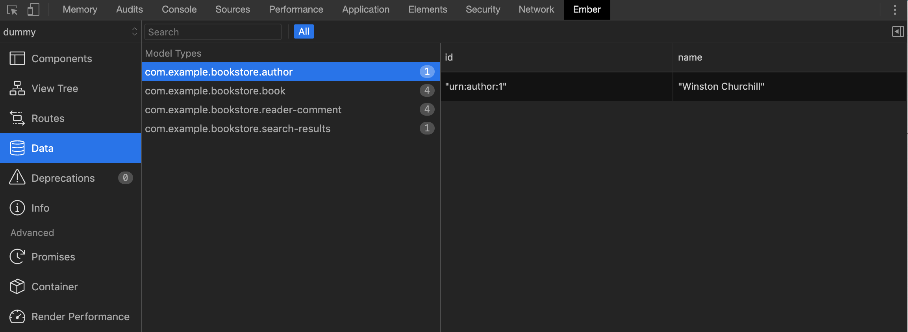

# ember-m3

## Debugging

If you are used to interacting with `@ember-data/model` records, it can be intimidating to see
a proxy object wrapping an `m3` model in the console:


However, there are some convenience methods and tools to make it easier for you to understand
exactly what data is inside the proxy.

### Ember Inspector

As of `ember-m3@0.11.5`, `m3` record types are supported by Ember Inspector. If you have the extension installed you can
go the pane in devtools and click on the `Data` tab to see the records that are currently loaded into
your application.


### debugJSON

This method is used to get the JSON from a particular `m3` record in the store.
It is fairly easy to use and is helpful if you already have a reference to the record and want to
inspect all the attributes and values associated with it:

```
// Calling this in the devtools console:
this.store.peekRecord('com.example.bookstore.book', 'isbn:9780760768587').debugJSON();
// Returns this data:
{
  "author": "urn:author:1",
  "name": "The New World",
  "pubDate": "April 2005",
  "readerComments": []
}
```

You can also grab an instance of the record off Ember Inspector by clicking on the `$E` button after you have selected a specific record in the data pane. You can then call `$E.debugJSON()` in the console.

NOTE: This only includes the data sent over by the server. If you have made any unsaved local changes to the record, they will
not be reflected in `.debugJSON`. Instead you can grab the local attribute value by using `get`.

### eachAttribute

Sometimes you may just want to inspect and iterate through each of the attributes in the `m3` record.
`.eachAttribute` allows you to do this in case you want to put in a breakpoint or do some other action to the record:

```
const book = this.store.peekRecord('com.example.bookstore.book', 'isbn:9780760768587');
book.eachAttribute((attributeName) => {
  // Put a breakpoint or other logic here
});
```

You can also interact with the record by using Ember Inspector and calling `$E.eachAttribute` on the instance.
